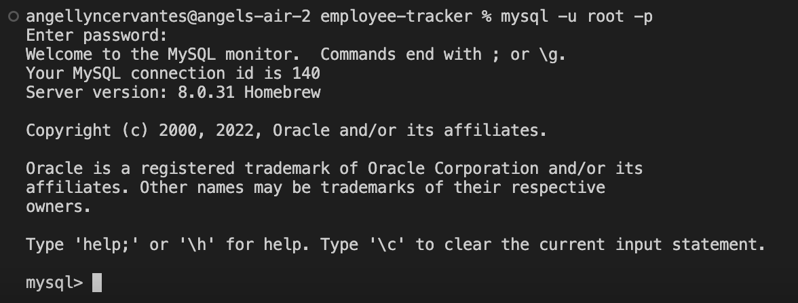
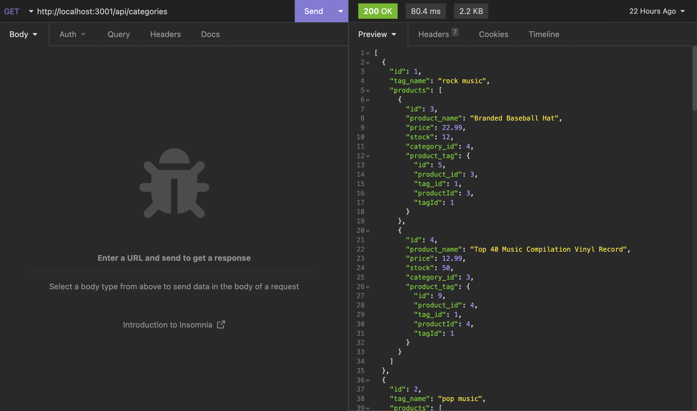
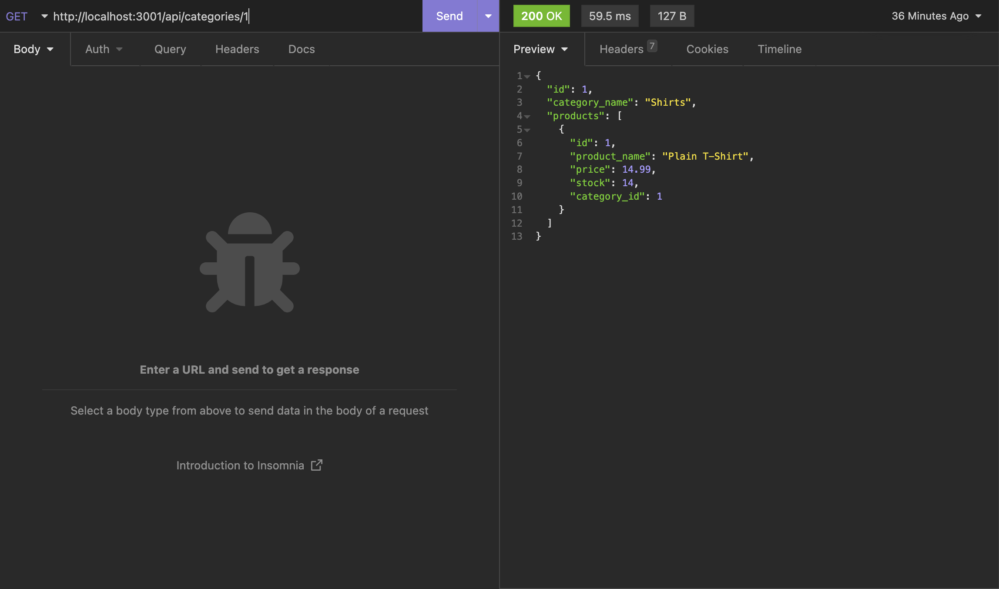
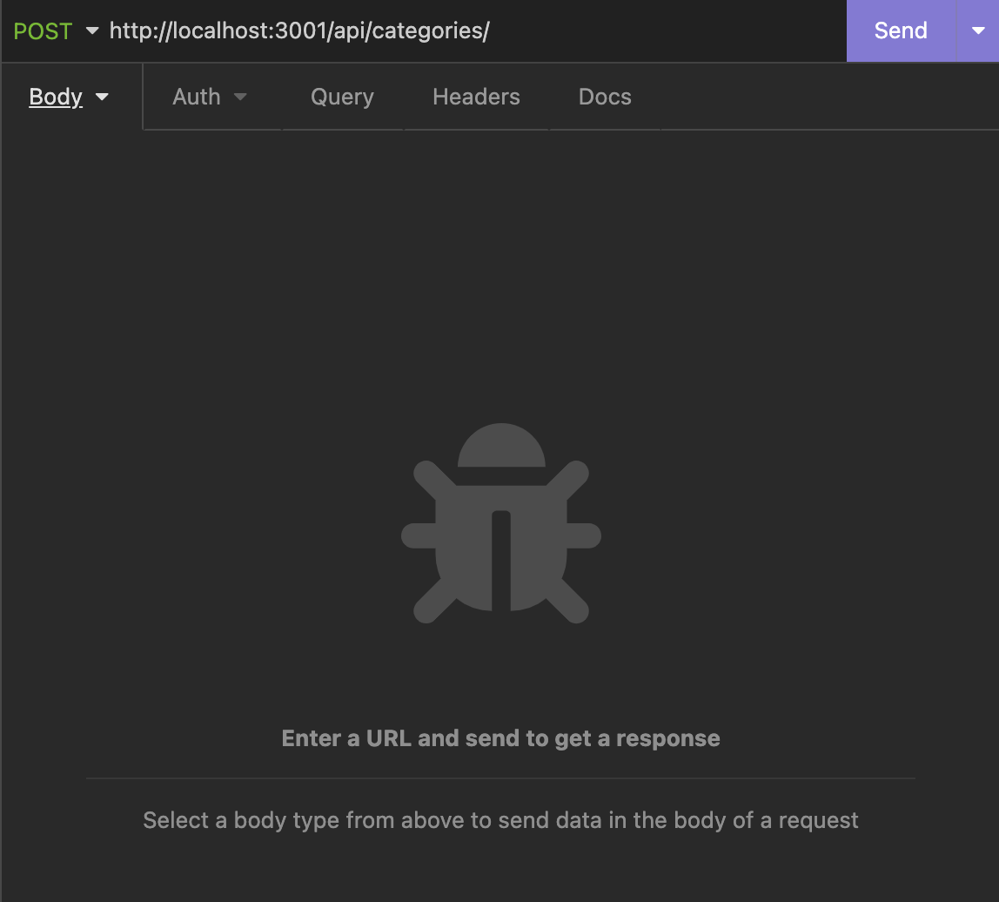
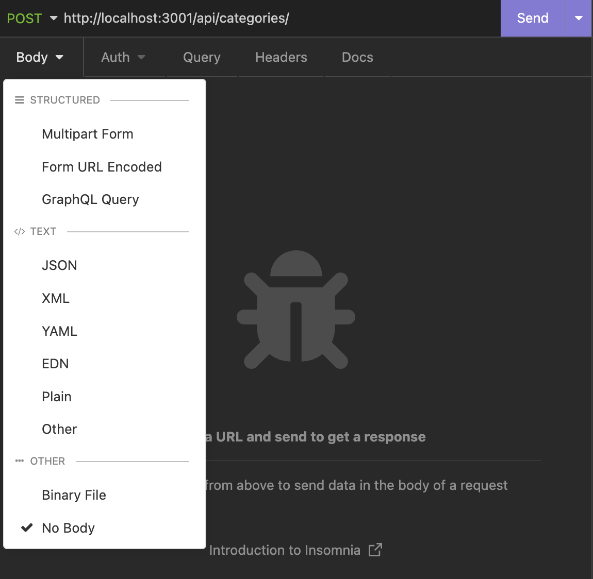
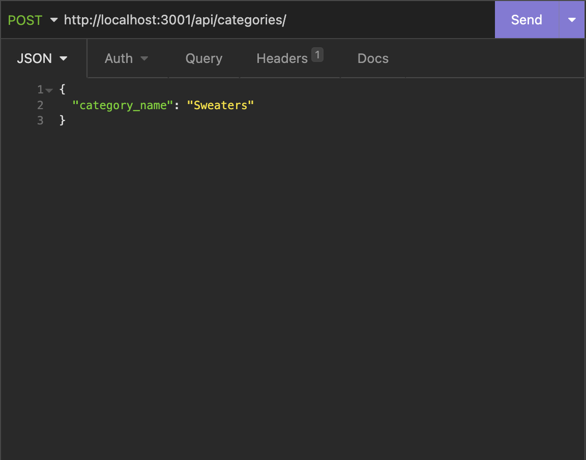
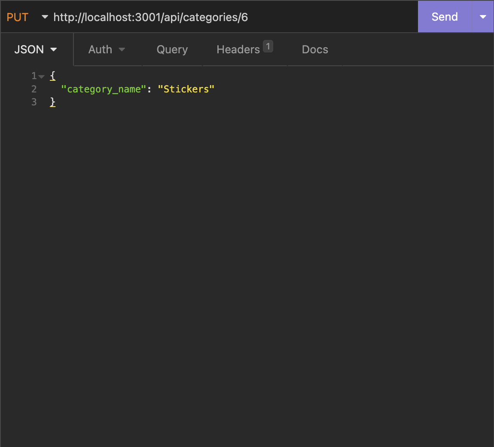
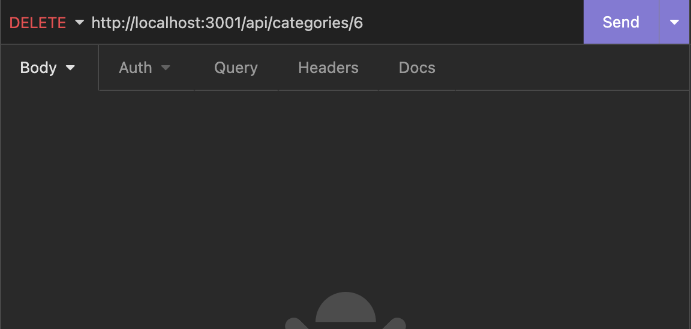

# E-Commerce Back End

## Description

In order to practice back-end development, I built this program. This project uses express to create the api application, mysql2 to store in and run the database, sequelize to model the data, and dotenv to get environment variables. 

The program takes the structures of categories, products, and tags and allows the user to manipulate data using those structures. This is similar to the back-end found on a shopping website.

## Table of Contents

- [Installation](#installation)
- [Usage](#usage)
- [Credits](#credits)
- [License](#license)
- [Badges](#badges)

## Installation

1. Click on green code button and copy the ssh link
2. Open up terminal or git bash, then navigate to where you want the repository to be placed.
3. Type out "git clone (ssh link)"
4. Be sure to install Node.js. Node.js is necessary to run this program. If you need to, download it from the [Node.js website](https://nodejs.org/en/download/).
5. Once you have installed Node.js, navigate to inside the 'ecommerce-back-end' folder
6. Run 'npm install' or 'npm i' to install packages within package.json
7. Install MySQL on your local computer's terminal. You can download a compatible version on [MySQL's dowload website](https://dev.mysql.com/downloads/mysql/).
8. Install Insomnia on your local computer. You can download it on [Insomnia's website](https://insomnia.rest/)

## Usage

Before you run this program, you need to create a database using MySQL. Navigate into your 'ecommerce-back-end' folder. Log into your terminal's MySQL by typing in 'mysql -u root -p' and entering your password when prompted. If this does not work, set your local machine to have the default user 'root' and try again.



Create a database by copying and pasting the code from 'schema.sql' (in the 'db' folder) into your terminal. You can also create a database by running 'source db/schema.sql' in MySQL. To quit MySQL, type in '\q' into your terminal and press return.

To seed the database, run 'npm run seed' in your terminal. 

Now, type 'npm start' in your terminal to run the program. This will start a server on your local computer.

Open up Insomnia. This is what can be used to call this application's API routes.

There are 3 possible API routes in this application: 'categories', 'products', and 'tags'. Each of these routes has 5 different functionalities: GET all, GET by id, POST (create), PUT (update) by id, and DELETE by id. 

To get all data in a given route, select GET in Insomnia's method dropdown and type this into the url input section: "http://localhost:3001/api/(route)". ((Route) is either 'categories', 'products', or 'tags'.) Press the send button to get the desired data.



To get an item by id (and its data) in a given route, select GET in Insomnia's method dropdown and type this into the url input section: "http://localhost:3001/api/(route)/(id)". ('Route' is either 'categories', 'products', or 'tags' while 'id' is the integer associated with the desired item.) Press the send button to get the desired data.



To create a new item in a given route, select POST in Insomnia's method dropdown and type this into the url input section: "http://localhost:3001/api/(route)". ((Route) is either 'categories', 'products', or 'tags'.)



You will also need to add a json body to post. To do this, click on the input dropdown right under the method dropdown (currently 'POST'). The input dropdown should have the default text 'body' showing, but it could be another data type. Once the drop down is opened, select 'JSON' as the input type.



For categories, you will need to format your input like the following

```
{
	"category_name": (string)
}
```

For products, you will need to format your input like the following. ('category_id' links to a category and 'tagIds' link to an array of tag ids). 

```
{
	"product_name": (string),
	"price": (decimal, between 10^0 and 10^{-2}),
	"stock": (integer or null),
	"category_id": (integer),
	"tagIds": [(array of integers)]
}
```

For tags, you will need to format your input like the following. ('productIds' link to an array of product ids)

```
{
	"tag_name": (string),
	"productIds": [(array of integers)]
}
```

The final product before pressing the 'send' button will look something like this:



To update an item by id and its data in a given route, select PUT in Insomnia's method dropdown and type this into the url input section: "http://localhost:3001/api/(route)/(id)". ('Route' is either 'categories', 'products', or 'tags' while 'id' is the integer associated with the desired item.)


Like with the post method, you will also need to add a json item to update. Follow what was done with the post method above. When you have a screen that resembles the 
one below, you can press the send button.



To delete an item by id and its data in a given route, select DELETE in Insomnia's method dropdown and type this into the url input section: "http://localhost:3001/api/(route)/(id)". ('Route' is either 'categories', 'products', or 'tags' while 'id' is the integer associated with the desired item.) Press the send button to delete the data.



When you want to stop running the server in your terminal, press 'control + c'. This will stop the port from listening

For a full walkthrough of this program, watch [this video](https://watch.screencastify.com/v/5fcVtETlqynYLnhvIN6s)

## Credits

belongsToMany: https://sequelize.org/api/v6/class/src/associations/belongs-to-many.js~belongstomany 

sequelize.sync: https://sequelize.org/docs/v6/core-concepts/model-basics/ 

sequelize finders: https://sequelize.org/docs/v6/core-concepts/model-querying-finders/#findone 

sequelize decimal (-2 degree): https://stackoverflow.com/questions/50354817/sequelize-decimal-data-save-with-2-decimal-points 

## License

Please refer to LICENSE in this repository

## Badges


